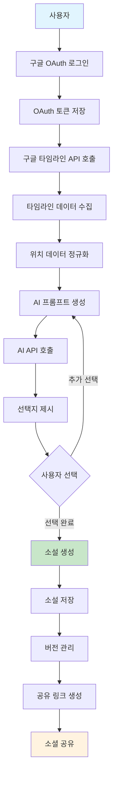
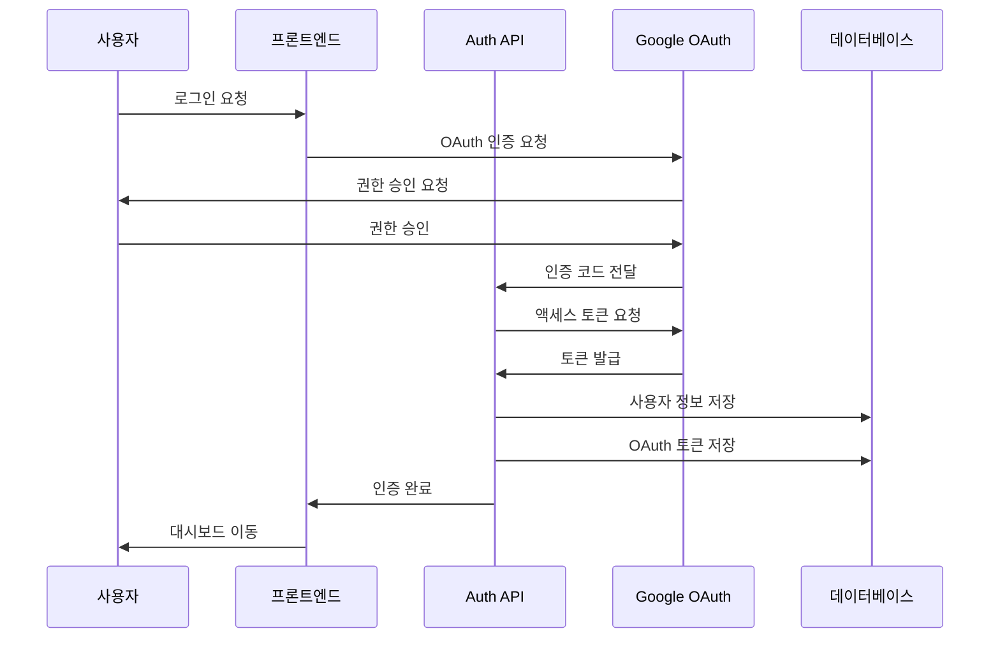
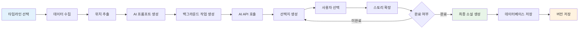
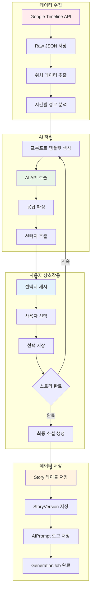
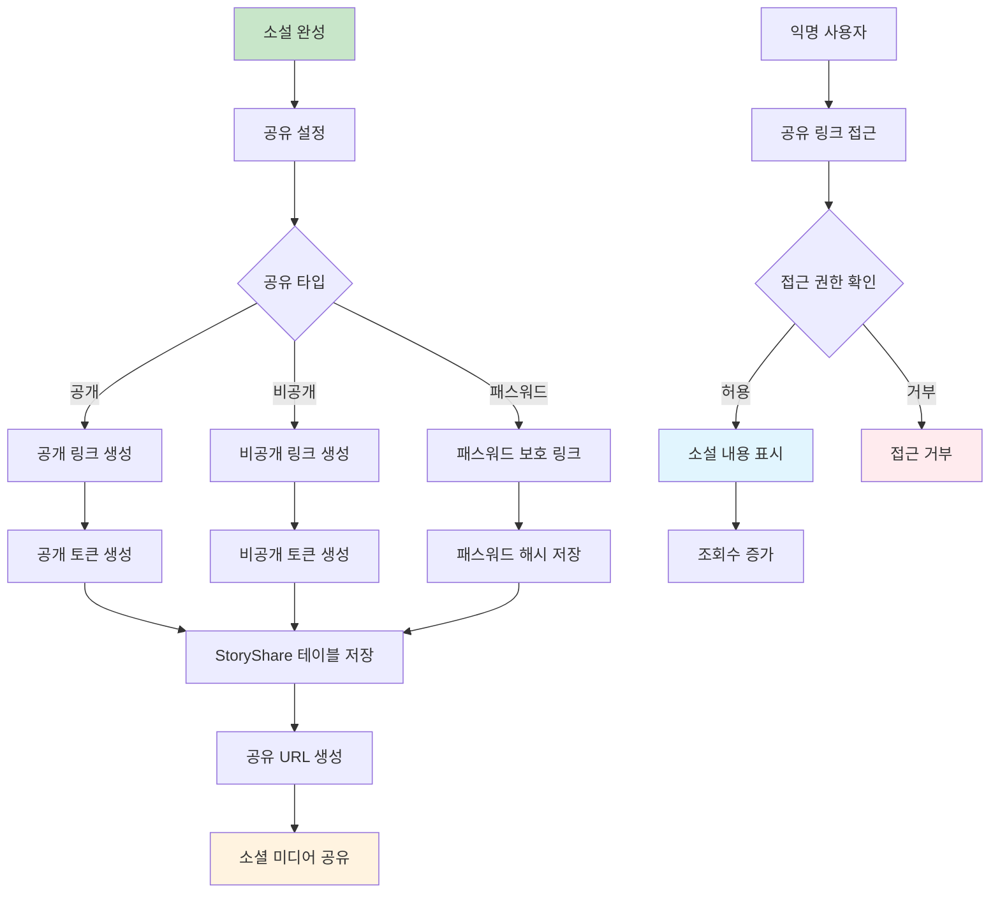
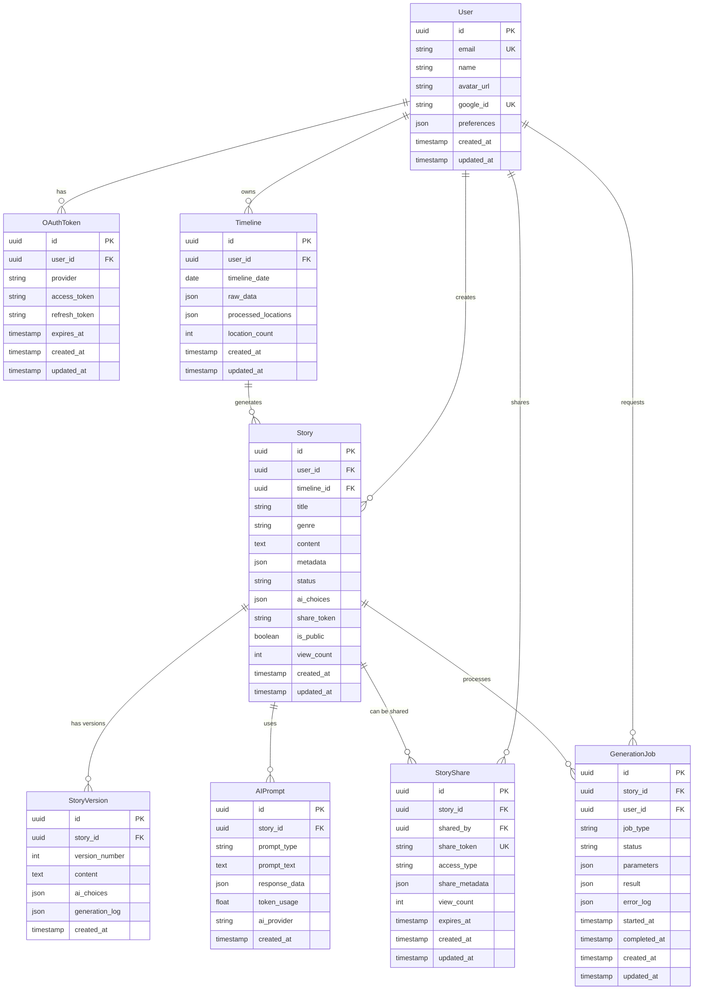

# 데이터베이스 스키마 설계 (ERD)

## 개요
구글 타임라인 기반 AI 소설 생성 서비스를 위한 데이터베이스 스키마입니다.  
Supabase(PostgreSQL) + Prisma ORM 기반으로 설계되었습니다.

---

## 1. 데이터 플로우 다이어그램

### 1.1 전체 시스템 데이터 플로우


### 1.2 사용자 인증 플로우


### 1.3 소설 생성 플로우


### 1.4 데이터 처리 파이프라인


### 1.5 공유 및 접근 제어 플로우


---

## 2. 엔티티 관계 다이어그램



---

## 2. 테이블 상세 설계

### 2.1 User (사용자)
사용자 기본 정보 및 프로필 관리

| 컬럼 | 타입 | 제약조건 | 설명 |
|------|------|----------|------|
| id | UUID | PRIMARY KEY | 사용자 고유 식별자 |
| email | VARCHAR(255) | UNIQUE, NOT NULL | 사용자 이메일 |
| name | VARCHAR(100) | NOT NULL | 사용자 이름 |
| avatar_url | TEXT | NULL | 프로필 이미지 URL |
| google_id | VARCHAR(100) | UNIQUE, NOT NULL | 구글 계정 ID |
| preferences | JSONB | DEFAULT '{}' | 사용자 설정 (언어, 알림 등) |
| created_at | TIMESTAMP | DEFAULT NOW() | 계정 생성일 |
| updated_at | TIMESTAMP | DEFAULT NOW() | 마지막 업데이트일 |

**인덱스:**
- `idx_user_email` ON (email)
- `idx_user_google_id` ON (google_id)

### 2.2 OAuthToken (OAuth 토큰)
구글 OAuth 토큰 관리

| 컬럼 | 타입 | 제약조건 | 설명 |
|------|------|----------|------|
| id | UUID | PRIMARY KEY | 토큰 고유 식별자 |
| user_id | UUID | FOREIGN KEY, NOT NULL | 사용자 ID |
| provider | VARCHAR(50) | NOT NULL | OAuth 제공자 (google) |
| access_token | TEXT | NOT NULL | 액세스 토큰 (암호화) |
| refresh_token | TEXT | NULL | 리프레시 토큰 (암호화) |
| expires_at | TIMESTAMP | NOT NULL | 토큰 만료일 |
| created_at | TIMESTAMP | DEFAULT NOW() | 토큰 생성일 |
| updated_at | TIMESTAMP | DEFAULT NOW() | 토큰 업데이트일 |

**인덱스:**
- `idx_oauth_user_provider` ON (user_id, provider)
- `idx_oauth_expires_at` ON (expires_at)

### 2.3 Timeline (타임라인 데이터)
구글 타임라인 원본 및 처리된 데이터

| 컬럼 | 타입 | 제약조건 | 설명 |
|------|------|----------|------|
| id | UUID | PRIMARY KEY | 타임라인 고유 식별자 |
| user_id | UUID | FOREIGN KEY, NOT NULL | 사용자 ID |
| timeline_date | DATE | NOT NULL | 타임라인 날짜 |
| raw_data | JSONB | NOT NULL | 구글 타임라인 원본 데이터 |
| processed_locations | JSONB | NULL | 처리된 위치 정보 |
| location_count | INTEGER | DEFAULT 0 | 위치 개수 |
| created_at | TIMESTAMP | DEFAULT NOW() | 데이터 수집일 |
| updated_at | TIMESTAMP | DEFAULT NOW() | 마지막 업데이트일 |

**인덱스:**
- `idx_timeline_user_date` ON (user_id, timeline_date)
- `idx_timeline_date` ON (timeline_date)
- `idx_timeline_location_count` ON (location_count)

### 2.4 Story (소설)
AI 생성 소설 메타데이터 및 콘텐츠

| 컬럼 | 타입 | 제약조건 | 설명 |
|------|------|----------|------|
| id | UUID | PRIMARY KEY | 소설 고유 식별자 |
| user_id | UUID | FOREIGN KEY, NOT NULL | 작성자 ID |
| timeline_id | UUID | FOREIGN KEY, NOT NULL | 기반 타임라인 ID |
| title | VARCHAR(200) | NOT NULL | 소설 제목 |
| genre | VARCHAR(50) | NOT NULL | 장르 (SF, 로맨스, 코미디 등) |
| content | TEXT | NOT NULL | 소설 본문 |
| metadata | JSONB | DEFAULT '{}' | 소설 메타데이터 |
| status | VARCHAR(20) | DEFAULT 'draft' | 상태 (draft, published, archived) |
| ai_choices | JSONB | DEFAULT '[]' | AI 선택지 데이터 |
| share_token | VARCHAR(100) | UNIQUE, NULL | 공유 토큰 |
| is_public | BOOLEAN | DEFAULT FALSE | 공개 여부 |
| view_count | INTEGER | DEFAULT 0 | 조회수 |
| created_at | TIMESTAMP | DEFAULT NOW() | 소설 생성일 |
| updated_at | TIMESTAMP | DEFAULT NOW() | 마지막 업데이트일 |

**인덱스:**
- `idx_story_user_created` ON (user_id, created_at DESC)
- `idx_story_timeline` ON (timeline_id)
- `idx_story_share_token` ON (share_token)
- `idx_story_public_created` ON (is_public, created_at DESC)

### 2.5 StoryVersion (소설 버전)
소설 버전 관리 및 히스토리

| 컬럼 | 타입 | 제약조건 | 설명 |
|------|------|----------|------|
| id | UUID | PRIMARY KEY | 버전 고유 식별자 |
| story_id | UUID | FOREIGN KEY, NOT NULL | 소설 ID |
| version_number | INTEGER | NOT NULL | 버전 번호 |
| content | TEXT | NOT NULL | 해당 버전 소설 본문 |
| ai_choices | JSONB | DEFAULT '[]' | 해당 버전 AI 선택지 |
| generation_log | JSONB | DEFAULT '{}' | 생성 로그 |
| created_at | TIMESTAMP | DEFAULT NOW() | 버전 생성일 |

**인덱스:**
- `idx_story_version_story_version` ON (story_id, version_number)
- `idx_story_version_created` ON (created_at DESC)

### 2.6 StoryShare (소설 공유)
소설 공유 링크 및 권한 관리

| 컬럼 | 타입 | 제약조건 | 설명 |
|------|------|----------|------|
| id | UUID | PRIMARY KEY | 공유 고유 식별자 |
| story_id | UUID | FOREIGN KEY, NOT NULL | 소설 ID |
| shared_by | UUID | FOREIGN KEY, NOT NULL | 공유한 사용자 ID |
| share_token | VARCHAR(100) | UNIQUE, NOT NULL | 공유 토큰 |
| access_type | VARCHAR(20) | DEFAULT 'public' | 접근 타입 (public, private, password) |
| share_metadata | JSONB | DEFAULT '{}' | 공유 메타데이터 |
| view_count | INTEGER | DEFAULT 0 | 공유 링크 조회수 |
| expires_at | TIMESTAMP | NULL | 공유 만료일 |
| created_at | TIMESTAMP | DEFAULT NOW() | 공유 생성일 |
| updated_at | TIMESTAMP | DEFAULT NOW() | 마지막 업데이트일 |

**인덱스:**
- `idx_story_share_token` ON (share_token)
- `idx_story_share_story` ON (story_id)
- `idx_story_share_expires` ON (expires_at)

### 2.7 AIPrompt (AI 프롬프트)
AI API 호출 및 응답 로깅

| 컬럼 | 타입 | 제약조건 | 설명 |
|------|------|----------|------|
| id | UUID | PRIMARY KEY | 프롬프트 고유 식별자 |
| story_id | UUID | FOREIGN KEY, NOT NULL | 소설 ID |
| prompt_type | VARCHAR(50) | NOT NULL | 프롬프트 타입 (story, choice, title 등) |
| prompt_text | TEXT | NOT NULL | 프롬프트 텍스트 |
| response_data | JSONB | NOT NULL | AI 응답 데이터 |
| token_usage | DECIMAL(10,2) | DEFAULT 0 | 토큰 사용량 |
| ai_provider | VARCHAR(50) | NOT NULL | AI 제공자 (openai, anthropic) |
| created_at | TIMESTAMP | DEFAULT NOW() | 프롬프트 생성일 |

**인덱스:**
- `idx_ai_prompt_story` ON (story_id)
- `idx_ai_prompt_type` ON (prompt_type)
- `idx_ai_prompt_provider` ON (ai_provider)
- `idx_ai_prompt_created` ON (created_at DESC)

### 2.8 GenerationJob (생성 작업)
백그라운드 작업 관리

| 컬럼 | 타입 | 제약조건 | 설명 |
|------|------|----------|------|
| id | UUID | PRIMARY KEY | 작업 고유 식별자 |
| story_id | UUID | FOREIGN KEY, NOT NULL | 소설 ID |
| user_id | UUID | FOREIGN KEY, NOT NULL | 사용자 ID |
| job_type | VARCHAR(50) | NOT NULL | 작업 타입 (story_generation, image_generation) |
| status | VARCHAR(20) | DEFAULT 'pending' | 작업 상태 (pending, processing, completed, failed) |
| parameters | JSONB | DEFAULT '{}' | 작업 매개변수 |
| result | JSONB | NULL | 작업 결과 |
| error_log | JSONB | NULL | 오류 로그 |
| started_at | TIMESTAMP | NULL | 작업 시작일 |
| completed_at | TIMESTAMP | NULL | 작업 완료일 |
| created_at | TIMESTAMP | DEFAULT NOW() | 작업 생성일 |
| updated_at | TIMESTAMP | DEFAULT NOW() | 마지막 업데이트일 |

**인덱스:**
- `idx_generation_job_status` ON (status)
- `idx_generation_job_user` ON (user_id)
- `idx_generation_job_story` ON (story_id)
- `idx_generation_job_created` ON (created_at DESC)

---

## 3. 보안 및 성능 고려사항

### 3.1 보안 (Security)
- **데이터 암호화**: OAuth 토큰은 AES-256으로 암호화 저장
- **RLS(Row Level Security)**: 사용자별 데이터 접근 제어
- **토큰 관리**: 만료된 토큰 자동 정리 (7일 배치)
- **접근 제어**: 각 테이블별 적절한 권한 설정

### 3.2 성능 (Performance)
- **인덱스 최적화**: 자주 조회되는 컬럼에 인덱스 설정
- **JSONB 활용**: 메타데이터 저장 시 효율적인 쿼리 지원
- **파티셔닝**: 대용량 데이터 시 날짜별 파티셔닝 고려
- **캐싱**: 자주 조회되는 데이터 Redis 캐싱

### 3.3 데이터 무결성 (Data Integrity)
- **외래키 제약**: 참조 무결성 보장
- **체크 제약**: 상태 값 등 유효성 검사
- **트리거**: updated_at 자동 업데이트
- **백업**: 일일 자동 백업 및 Point-in-Time Recovery

---

## 4. 마이그레이션 스크립트

### 4.1 초기 테이블 생성
```sql
-- Users table
CREATE TABLE users (
    id UUID PRIMARY KEY DEFAULT gen_random_uuid(),
    email VARCHAR(255) UNIQUE NOT NULL,
    name VARCHAR(100) NOT NULL,
    avatar_url TEXT,
    google_id VARCHAR(100) UNIQUE NOT NULL,
    preferences JSONB DEFAULT '{}',
    created_at TIMESTAMP WITH TIME ZONE DEFAULT NOW(),
    updated_at TIMESTAMP WITH TIME ZONE DEFAULT NOW()
);

-- OAuth tokens table
CREATE TABLE oauth_tokens (
    id UUID PRIMARY KEY DEFAULT gen_random_uuid(),
    user_id UUID NOT NULL REFERENCES users(id) ON DELETE CASCADE,
    provider VARCHAR(50) NOT NULL,
    access_token TEXT NOT NULL,
    refresh_token TEXT,
    expires_at TIMESTAMP WITH TIME ZONE NOT NULL,
    created_at TIMESTAMP WITH TIME ZONE DEFAULT NOW(),
    updated_at TIMESTAMP WITH TIME ZONE DEFAULT NOW()
);

-- Timeline data table
CREATE TABLE timelines (
    id UUID PRIMARY KEY DEFAULT gen_random_uuid(),
    user_id UUID NOT NULL REFERENCES users(id) ON DELETE CASCADE,
    timeline_date DATE NOT NULL,
    raw_data JSONB NOT NULL,
    processed_locations JSONB,
    location_count INTEGER DEFAULT 0,
    created_at TIMESTAMP WITH TIME ZONE DEFAULT NOW(),
    updated_at TIMESTAMP WITH TIME ZONE DEFAULT NOW()
);

-- Stories table
CREATE TABLE stories (
    id UUID PRIMARY KEY DEFAULT gen_random_uuid(),
    user_id UUID NOT NULL REFERENCES users(id) ON DELETE CASCADE,
    timeline_id UUID NOT NULL REFERENCES timelines(id) ON DELETE CASCADE,
    title VARCHAR(200) NOT NULL,
    genre VARCHAR(50) NOT NULL,
    content TEXT NOT NULL,
    metadata JSONB DEFAULT '{}',
    status VARCHAR(20) DEFAULT 'draft',
    ai_choices JSONB DEFAULT '[]',
    share_token VARCHAR(100) UNIQUE,
    is_public BOOLEAN DEFAULT FALSE,
    view_count INTEGER DEFAULT 0,
    created_at TIMESTAMP WITH TIME ZONE DEFAULT NOW(),
    updated_at TIMESTAMP WITH TIME ZONE DEFAULT NOW()
);

-- Story versions table
CREATE TABLE story_versions (
    id UUID PRIMARY KEY DEFAULT gen_random_uuid(),
    story_id UUID NOT NULL REFERENCES stories(id) ON DELETE CASCADE,
    version_number INTEGER NOT NULL,
    content TEXT NOT NULL,
    ai_choices JSONB DEFAULT '[]',
    generation_log JSONB DEFAULT '{}',
    created_at TIMESTAMP WITH TIME ZONE DEFAULT NOW(),
    UNIQUE(story_id, version_number)
);

-- Story shares table
CREATE TABLE story_shares (
    id UUID PRIMARY KEY DEFAULT gen_random_uuid(),
    story_id UUID NOT NULL REFERENCES stories(id) ON DELETE CASCADE,
    shared_by UUID NOT NULL REFERENCES users(id) ON DELETE CASCADE,
    share_token VARCHAR(100) UNIQUE NOT NULL,
    access_type VARCHAR(20) DEFAULT 'public',
    share_metadata JSONB DEFAULT '{}',
    view_count INTEGER DEFAULT 0,
    expires_at TIMESTAMP WITH TIME ZONE,
    created_at TIMESTAMP WITH TIME ZONE DEFAULT NOW(),
    updated_at TIMESTAMP WITH TIME ZONE DEFAULT NOW()
);

-- AI prompts table
CREATE TABLE ai_prompts (
    id UUID PRIMARY KEY DEFAULT gen_random_uuid(),
    story_id UUID NOT NULL REFERENCES stories(id) ON DELETE CASCADE,
    prompt_type VARCHAR(50) NOT NULL,
    prompt_text TEXT NOT NULL,
    response_data JSONB NOT NULL,
    token_usage DECIMAL(10,2) DEFAULT 0,
    ai_provider VARCHAR(50) NOT NULL,
    created_at TIMESTAMP WITH TIME ZONE DEFAULT NOW()
);

-- Generation jobs table
CREATE TABLE generation_jobs (
    id UUID PRIMARY KEY DEFAULT gen_random_uuid(),
    story_id UUID NOT NULL REFERENCES stories(id) ON DELETE CASCADE,
    user_id UUID NOT NULL REFERENCES users(id) ON DELETE CASCADE,
    job_type VARCHAR(50) NOT NULL,
    status VARCHAR(20) DEFAULT 'pending',
    parameters JSONB DEFAULT '{}',
    result JSONB,
    error_log JSONB,
    started_at TIMESTAMP WITH TIME ZONE,
    completed_at TIMESTAMP WITH TIME ZONE,
    created_at TIMESTAMP WITH TIME ZONE DEFAULT NOW(),
    updated_at TIMESTAMP WITH TIME ZONE DEFAULT NOW()
);
```

### 4.2 인덱스 생성
```sql
-- User indexes
CREATE INDEX idx_user_email ON users(email);
CREATE INDEX idx_user_google_id ON users(google_id);

-- OAuth token indexes
CREATE INDEX idx_oauth_user_provider ON oauth_tokens(user_id, provider);
CREATE INDEX idx_oauth_expires_at ON oauth_tokens(expires_at);

-- Timeline indexes
CREATE INDEX idx_timeline_user_date ON timelines(user_id, timeline_date);
CREATE INDEX idx_timeline_date ON timelines(timeline_date);
CREATE INDEX idx_timeline_location_count ON timelines(location_count);

-- Story indexes
CREATE INDEX idx_story_user_created ON stories(user_id, created_at DESC);
CREATE INDEX idx_story_timeline ON stories(timeline_id);
CREATE INDEX idx_story_share_token ON stories(share_token);
CREATE INDEX idx_story_public_created ON stories(is_public, created_at DESC);

-- Story version indexes
CREATE INDEX idx_story_version_story_version ON story_versions(story_id, version_number);
CREATE INDEX idx_story_version_created ON story_versions(created_at DESC);

-- Story share indexes
CREATE INDEX idx_story_share_token ON story_shares(share_token);
CREATE INDEX idx_story_share_story ON story_shares(story_id);
CREATE INDEX idx_story_share_expires ON story_shares(expires_at);

-- AI prompt indexes
CREATE INDEX idx_ai_prompt_story ON ai_prompts(story_id);
CREATE INDEX idx_ai_prompt_type ON ai_prompts(prompt_type);
CREATE INDEX idx_ai_prompt_provider ON ai_prompts(ai_provider);
CREATE INDEX idx_ai_prompt_created ON ai_prompts(created_at DESC);

-- Generation job indexes
CREATE INDEX idx_generation_job_status ON generation_jobs(status);
CREATE INDEX idx_generation_job_user ON generation_jobs(user_id);
CREATE INDEX idx_generation_job_story ON generation_jobs(story_id);
CREATE INDEX idx_generation_job_created ON generation_jobs(created_at DESC);
```

### 4.3 트리거 및 함수
```sql
-- Updated at trigger function
CREATE OR REPLACE FUNCTION update_updated_at_column()
RETURNS TRIGGER AS $$
BEGIN
    NEW.updated_at = NOW();
    RETURN NEW;
END;
$$ language 'plpgsql';

-- Apply trigger to tables
CREATE TRIGGER update_users_updated_at BEFORE UPDATE ON users
    FOR EACH ROW EXECUTE FUNCTION update_updated_at_column();

CREATE TRIGGER update_oauth_tokens_updated_at BEFORE UPDATE ON oauth_tokens
    FOR EACH ROW EXECUTE FUNCTION update_updated_at_column();

CREATE TRIGGER update_timelines_updated_at BEFORE UPDATE ON timelines
    FOR EACH ROW EXECUTE FUNCTION update_updated_at_column();

CREATE TRIGGER update_stories_updated_at BEFORE UPDATE ON stories
    FOR EACH ROW EXECUTE FUNCTION update_updated_at_column();

CREATE TRIGGER update_story_shares_updated_at BEFORE UPDATE ON story_shares
    FOR EACH ROW EXECUTE FUNCTION update_updated_at_column();

CREATE TRIGGER update_generation_jobs_updated_at BEFORE UPDATE ON generation_jobs
    FOR EACH ROW EXECUTE FUNCTION update_updated_at_column();
```

### 4.4 RLS (Row Level Security) 설정
```sql
-- Enable RLS
ALTER TABLE users ENABLE ROW LEVEL SECURITY;
ALTER TABLE oauth_tokens ENABLE ROW LEVEL SECURITY;
ALTER TABLE timelines ENABLE ROW LEVEL SECURITY;
ALTER TABLE stories ENABLE ROW LEVEL SECURITY;
ALTER TABLE story_versions ENABLE ROW LEVEL SECURITY;
ALTER TABLE story_shares ENABLE ROW LEVEL SECURITY;
ALTER TABLE ai_prompts ENABLE ROW LEVEL SECURITY;
ALTER TABLE generation_jobs ENABLE ROW LEVEL SECURITY;

-- User policies
CREATE POLICY user_own_data ON users
    FOR ALL USING (auth.uid() = id);

-- OAuth token policies
CREATE POLICY oauth_token_own_data ON oauth_tokens
    FOR ALL USING (auth.uid() = user_id);

-- Timeline policies
CREATE POLICY timeline_own_data ON timelines
    FOR ALL USING (auth.uid() = user_id);

-- Story policies
CREATE POLICY story_own_data ON stories
    FOR ALL USING (auth.uid() = user_id);

CREATE POLICY story_public_read ON stories
    FOR SELECT USING (is_public = true);

-- Story version policies
CREATE POLICY story_version_own_data ON story_versions
    FOR ALL USING (auth.uid() = (SELECT user_id FROM stories WHERE id = story_id));

-- Story share policies
CREATE POLICY story_share_own_data ON story_shares
    FOR ALL USING (auth.uid() = shared_by);

-- AI prompt policies
CREATE POLICY ai_prompt_own_data ON ai_prompts
    FOR ALL USING (auth.uid() = (SELECT user_id FROM stories WHERE id = story_id));

-- Generation job policies
CREATE POLICY generation_job_own_data ON generation_jobs
    FOR ALL USING (auth.uid() = user_id);
```

---

## 5. 향후 확장 고려사항

### 5.1 확장 가능한 구조
- **멀티미디어 지원**: 이미지, 오디오 첨부 테이블 추가
- **소셜 기능**: 좋아요, 댓글, 팔로우 테이블 추가
- **프리미엄 기능**: 구독, 결제 관련 테이블 추가
- **분석 기능**: 사용자 행동 분석 테이블 추가

### 5.2 성능 최적화
- **읽기 전용 복제본**: 대용량 조회 시 읽기 전용 DB 활용
- **데이터 아카이빙**: 오래된 데이터 별도 아카이브 테이블 이동
- **샤딩**: 사용자별 데이터 분산 저장 고려

### 5.3 모니터링 및 관리
- **로깅 테이블**: 시스템 로그, 사용자 활동 로그
- **메트릭 테이블**: 성능 지표, 사용 통계
- **설정 테이블**: 시스템 설정, 기능 플래그

---

**이 ERD는 프로젝트의 요구사항과 아키텍처 문서를 기반으로 설계되었으며, 개발 진행에 따라 점진적으로 확장 및 개선될 수 있습니다.**