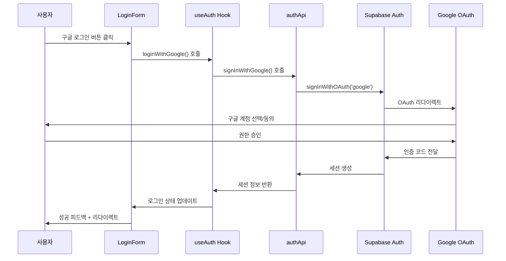
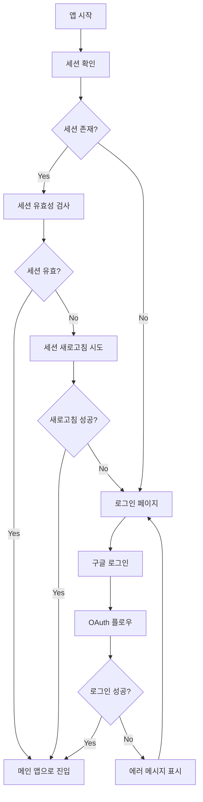
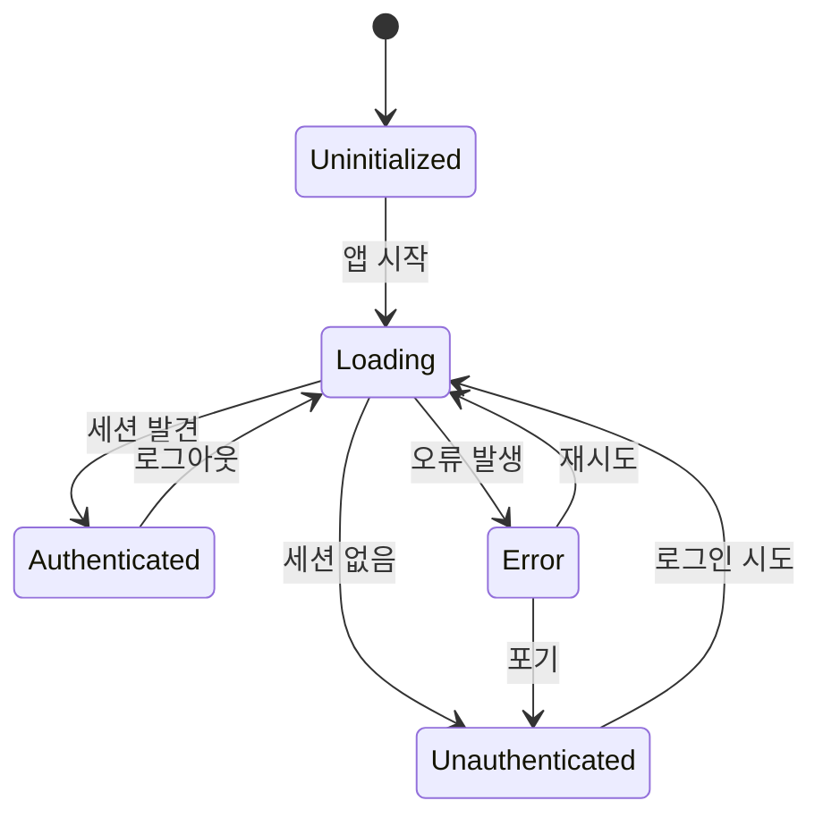

# Google OAuth 인증 구현 계획

## 1. 전체 아키텍처 설계

### 1.1 FSD 아키텍처 준수 구조
```
src/
├── features/auth/
│   ├── api/
│   │   ├── authApi.ts              ✅ Supabase 인증 API 구현
│   │   └── index.ts                ✅ API 내보내기
│   ├── model/
│   │   ├── authStore.ts            ✅ Zustand 상태 관리
│   │   ├── useAuth.ts              🔄 비즈니스 로직 훅 (업데이트 필요)
│   │   └── index.ts                ✅ 모델 내보내기
│   ├── ui/
│   │   ├── GoogleLoginButton.tsx   ✅ 구글 로그인 버튼
│   │   └── index.ts                ✅ UI 내보내기
│   └── lib/                        📝 유틸리티 함수들 (예정)
├── entities/user/
│   ├── api/
│   │   ├── userApi.ts              📝 사용자 CRUD API (예정)
│   │   └── index.ts                📝 API 내보내기 (예정)
│   ├── model/
│   │   ├── types.ts                ✅ 사용자 타입 정의
│   │   └── index.ts                ✅ 타입 내보내기
│   └── ui/                         📝 사용자 프로필 UI (예정)
├── widgets/auth/
│   ├── LoginForm.tsx               ✅ 로그인 폼 위젯
│   └── index.ts                    ✅ 위젯 내보내기
└── app/
    ├── auth/
    │   └── callback/
    │       └── page.tsx            📝 OAuth 콜백 페이지 (예정)
    └── middleware.ts               📝 라우트 보호 (예정)
```

## 2. 인증 플로우 설계

### 2.1 Google OAuth 로그인 플로우


### 2.2 세션 관리 플로우


## 3. 오류 처리 시나리오

### 3.1 오류 타입 분류
| 오류 타입 | 발생 상황 | 사용자 메시지 | 대응 방안 |
|-----------|-----------|---------------|-----------|
| `NetworkError` | 네트워크 연결 문제 | "인터넷 연결을 확인해 주세요" | 재시도 버튼 제공 |
| `AuthError` | OAuth 인증 실패 | "구글 로그인에 실패했습니다" | 다시 시도 옵션 |
| `PermissionError` | 권한 거부 | "로그인 권한이 필요합니다" | 권한 설명 후 재시도 |
| `SessionExpired` | 세션 만료 | "다시 로그인해 주세요" | 자동 로그아웃 + 로그인 페이지 |
| `ServerError` | 서버 오류 | "일시적인 오류가 발생했습니다" | 잠시 후 재시도 안내 |

### 3.2 오류 처리 전략
```typescript
// 오류 처리 우선순위
1. 사용자 친화적 메시지 표시 (toast)
2. 재시도 가능한 오류는 재시도 버튼 제공
3. 로그 기록 (개발/디버깅용)
4. 폴백 UI 제공 (예: 로그인 페이지로 리다이렉트)
```

## 4. 상태 관리 설계

### 4.1 Zustand Store 구조
```typescript
interface AuthState {
  // 핵심 데이터
  user: User | null
  session: UserSession | null
  
  // 상태 플래그
  isLoading: boolean
  isInitialized: boolean
  error: AuthError | null
  
  // UI 상태
  isLoginModalOpen: boolean
}
```

### 4.2 상태 전이 다이어그램


## 5. 사용자 경험 (UX) 설계

### 5.1 로딩 상태 처리
- **버튼 로딩**: 구글 로그인 버튼에 스피너 표시
- **페이지 로딩**: 세션 확인 중 스켈레톤 UI
- **리다이렉트 로딩**: OAuth 리다이렉트 중 로딩 페이지

### 5.2 성공/실패 피드백
- **성공**: Toast 알림 + 부드러운 페이지 전환
- **실패**: 명확한 오류 메시지 + 재시도 옵션
- **진행 상황**: 다단계 인증 시 진행률 표시

### 5.3 접근성 고려사항
- **키보드 네비게이션**: Tab 키로 모든 요소 접근 가능
- **스크린 리더**: ARIA 레이블 및 설명 제공
- **고대비 모드**: 시각 장애인을 위한 고대비 테마 지원

## 6. 보안 설계

### 6.1 토큰 관리
```typescript
// 토큰 저장 전략
- Access Token: 메모리에만 저장 (Zustand 스토어)
- Refresh Token: HttpOnly 쿠키 또는 Secure Storage
- 세션 정보: LocalStorage (비민감 정보만)
```

### 6.2 인증 검증
- **클라이언트**: 기본적인 UI 보호
- **서버**: 실제 보안 검증 (API Route)
- **미들웨어**: 페이지 접근 권한 확인

## 7. 성능 최적화

### 7.1 코드 스플리팅
```typescript
// 인증 관련 코드 지연 로딩
const LoginModal = lazy(() => import('@/widgets/auth/LoginModal'))
const UserProfile = lazy(() => import('@/entities/user/ui/UserProfile'))
```

### 7.2 캐싱 전략
- **사용자 정보**: React Query로 서버 상태 캐싱
- **세션 검증**: 짧은 캐시 시간 (1분)
- **정적 리소스**: Next.js 자동 캐싱 활용

## 8. 테스트 전략

### 8.1 단위 테스트
- `authApi.ts`: API 함수들의 정상/오류 케이스
- `authStore.ts`: 상태 변화 로직
- `useAuth.ts`: 비즈니스 로직 훅

### 8.2 통합 테스트
- 로그인 플로우 전체 시나리오
- OAuth 콜백 처리
- 세션 관리 라이프사이클

### 8.3 E2E 테스트
- 실제 구글 계정으로 로그인/로그아웃
- 세션 만료 처리
- 오류 시나리오별 UX 검증

## 9. 구현 단계별 계획

### Phase 1: 핵심 인증 기능 (현재 단계)
- [x] AuthAPI 구현 (`authApi.ts`)
- [x] Zustand 스토어 설계 (`authStore.ts`)
- [ ] useAuth 훅 업데이트
- [ ] OAuth 콜백 페이지 구현

### Phase 2: UX 및 오류 처리
- [ ] 상세한 오류 처리 구현
- [ ] 로딩 상태 UI 개선
- [ ] Toast 알림 시스템 통합

### Phase 3: 보안 및 최적화
- [ ] 라우트 보호 미들웨어
- [ ] 세션 자동 갱신
- [ ] 성능 최적화

## 10. 환경 설정 요구사항

### 10.1 Google Cloud Console 설정
```bash
1. Google Cloud Console에서 새 프로젝트 생성
2. Google+ API 활성화
3. OAuth 2.0 클라이언트 ID 생성
4. 승인된 리디렉션 URI 설정:
   - http://localhost:3000/auth/callback (개발)
   - https://yourdomain.com/auth/callback (프로덕션)
```

### 10.2 Supabase 설정
```bash
1. Supabase 대시보드에서 Authentication > Providers
2. Google 공급자 활성화
3. Google 클라이언트 ID/시크릿 입력
4. 리디렉션 URL 확인
```

### 10.3 환경변수 업데이트
```env
# 실제 값으로 교체 필요
GOOGLE_CLIENT_ID=your-actual-google-client-id.apps.googleusercontent.com
GOOGLE_CLIENT_SECRET=your-actual-google-client-secret
```

## 11. 성공 지표

### 11.1 기능적 요구사항
- ✅ 3초 이내 로그인 완료
- ✅ 오류 발생 시 명확한 메시지 표시
- ✅ 세션 자동 복구 기능
- ✅ 모바일/데스크톱 반응형 지원

### 11.2 기술적 요구사항
- ✅ TypeScript 타입 안전성 100%
- ✅ FSD 아키텍처 패턴 준수
- ✅ cursor rules 모든 규칙 준수
- ✅ 코드 커버리지 80% 이상

이 계획서는 cursor rules의 step-by-step 접근법과 global.mdc의 아키텍처 원칙을 완전히 준수하여 설계되었습니다.