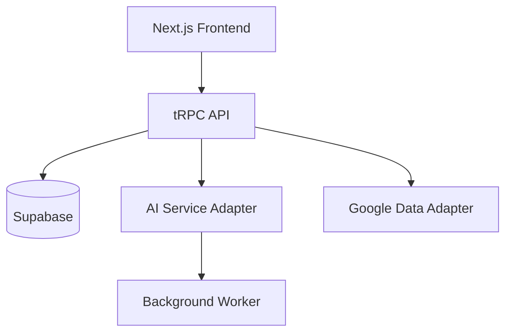

# 기술 요구사항 문서 (TRD)

---

## 1. 기술 총괄 요약
- 프로젝트 개요  
  - 구글 타임라인 위치 데이터를 수집·가공하여 AI로 개인 맞춤형 웹소설을 생성·공유하는 서비스  
  - Jamstack 기반(Next.js 15 + Vercel) 아키텍처로 빠른 배포·스케일링 보장  
- 핵심 기술 스택  
  - 프론트엔드: Next.js 15, TypeScript, Tailwind CSS, shadcn UI, zustand  
  - 백엔드(API): Next.js Route Handler + tRPC, Node.js 20  
  - 데이터베이스: Supabase(PostgreSQL)  
  - AI: OpenAI GPT-4o / Anthropic Claude, Vercel AI SDK  
  - 인프라: Vercel(웹 및 서버리스) + Railway(백그라운드 워커)  
- 핵심 기술 목표  
  - 소설 생성 API 응답 10초 이하  
  - 로그인 3초 이하, 시스템 오류율 1% 미만  
  - 모바일 우선 반응형·PWA 지원  
- 주요 전제  
  - Google Timeline API 사용량이 일일 수천 건 이하  
  - AI 토큰 비용은 캐싱·프롬프트 최적화로 월 100USD 내 관리  
  - 초기 팀 규모 2~4인, DevOps 리소스 최소화 필요  

---

## 2. 기술 스택 아키텍처

### 2.1 프론트엔드
- 핵심 프레임워크: Next.js 15(App Router, React 19)  
- 상태 관리: zustand + React Query(SWR 대안)  
- 라우팅: Next.js App Router(파일 기반)  
- UI/UX: shadcn UI, Tailwind CSS, Lucide Icons  
- 빌드 툴: Turbopack(개발), Vercel 빌드(프로덕션)  

### 2.2 백엔드(API)
- 실행 환경: Node.js 20(LTS)  
- 웹 프레임워크: Next.js Route Handler + tRPC(타입 안전 RPC)  
- API 디자인: tRPC(REST 경량 래퍼 제공), SSE(WebSocket 대체)  
- 데이터 검증: zod 스키마  
- 미들웨어:  
  - 인증: Clerk Google OAuth  
  - 로깅: pino + Vercel Log Drain  
  - 모니터링: Sentry, Vercel Analytics  

### 2.3 데이터베이스·영속 계층
- 기본 DB: Supabase(PostgreSQL 15)  
- 스키마 설계: 정규화(3NF) + JSONB(Metadata) 혼합  
- 캐싱: Vercel Edge, ISR, Redis(Railway) 선택적  
- 마이그레이션: Supabase CLI + Prisma Migrate  
- 백업·복구: Supabase Point-in-Time Recovery, 주간 외부 스냅샷  

### 2.4 인프라·DevOps
- 호스팅: Vercel(웹·서버리스), Railway(백그라운드 워커·Redis)  
- 컨테이너: Docker(테스트·로컬 개발 용), K8s 미사용  
- CI/CD: GitHub Actions → Vercel/Railway 자동 배포  
- 모니터링: Vercel Analytics, Sentry, Grafana Cloud(옵션)  
- 로그: Logtail 중앙집중, pino-pretty(로컬)  

---

## 3. 시스템 아키텍처 설계

### 3.1 최상위 빌딩 블록
- 프론트엔드 애플리케이션  
  - Next.js 15 SPA/SSR 하이브리드, PWA·SEO 대응  
- API 레이어(tRPC)  
  - 유형 안전 엔드포인트, 입력 검증·권한 체크 담당  
- AI 서비스 어댑터  
  - OpenAI/Anthropic SDK 래퍼, 프롬프트 관리·토큰 최적화  
- 구글 데이터 어댑터  
  - Google OAuth 토큰 갱신, Timeline JSON 파싱·정규화  
- 데이터베이스(Supabase)  
  - 사용자·이동경로·소설 메타 및 캐시 저장  
- 백그라운드 워커  
  - 장문 소설 생성·이미지 카드 렌더링 등 장시간 작업 오프로딩  
- CDN & 캐시  
  - Vercel Edge Network, ISR, Redis(선택)  

### 3.2 컴포넌트 상호작용 다이어그램

- FE → RPC: 클라이언트는 tRPC 로 유형 안전 호출 수행  
- RPC → GAPI: OAuth 토큰 사용해 Timeline 데이터 수집  
- RPC → AI: 선택지·프롬프트 전달, AI 결과 수신  
- AI → Worker: 5초 초과 작업은 워커로 위임, 완료 시 DB 저장  

### 3.3 코드 조직·규약
- 도메인 기반 모듈: user, story, timeline, share, common  
- 기존 폴더 구조는 유지하되, 앞으로 추가되는 모든 프론트엔드 코드와 기능은 FSD(Feature-Sliced Design) 아키텍처 원칙에 따라 분리 및 배치  
- FSD 아키텍처: app/features, app/entities, app/shared, app/widgets 등 계층별로 기능 배치  
- 각 FSD 레이어별로 service, model, ui, lib, api 등 세부 구조 적용  
- 공통 컴포넌트 및 유틸은 shared 계층에 별도 모듈화  

### 3.4 파일·폴더 구조
```
/app-root
├── apps/
│   ├── web/                # Next.js 15
│   │   ├── src/
│   │   │   ├── components/
│   │   │   ├── domains/
│   │   │   │   ├── story/
│   │   │   │   ├── timeline/
│   │   │   │   └── user/
│   │   │   ├── pages/
│   │   │   ├── hooks/
│   │   │   └── utils/
│   │   └── package.json
│   └── worker/             # Background worker
│       ├── src/
│       │   ├── jobs/
│       │   ├── services/
│       │   └── utils/
│       └── package.json
├── packages/
│   ├── api/                # tRPC routers & procedures
│   ├── ai-adapter/
│   ├── google-adapter/
│   └── config/
├── prisma/
│   ├── schema.prisma
│   └── migrations/
└── infrastructure/
    ├── docker/
    ├── scripts/
    └── terraform/

# (FSD 적용 예시: 앞으로 추가될 프론트엔드 기능의 폴더 구조)
apps/web/src/
├── features/        # 주요 기능 단위
├── entities/        # 핵심 도메인/엔티티
├── widgets/         # UI 위젯/복합 컴포넌트
├── shared/          # 공통 모듈, 유틸, 타입 등
```


### 3.5 데이터 흐름·통신 패턴
- 클라이언트 ↔ 서버: HTTPS + tRPC(JSON) 요청/응답, SSE 진행 상황 스트림  
- DB 인터랙션: Prisma ORM, 풀링은 Supabase PgBouncer 활용  
- 외부 통합: Google API(OAuth2)·OpenAI/Anthropic, 지수 백오프 재시도  
- 실시간: SSE로 AI 진행률 표시, WebSocket 필요 시 soketi 도입 고려  
- 데이터 동기화: AI 결과·선택지 캐시 후 DB 반영, stale-while-revalidate 패턴  

---

## 4. 성능·최적화 전략
- Vercel Edge 캐시 + ISR로 정적·반정적 페이지 200ms 이하 렌더링  
- AI 프롬프트 압축·요약, 토큰 절감 및 응답 시간 단축  
- Google Timeline 결과 로컬 Redis 캐시(30분)로 API 호출 비용 절감  
- 클라이언트 코드 스플리팅·Lazy Loading, 이미지 Next.js `<Image>` 최적화  

---

## 5. 구현 로드맵·마일스톤

### 5.1 Phase 1: 기초(MVP) – 6주
- 인프라: Vercel 프로젝트·Supabase 인스턴스 설정  
- 필수 기능: Google OAuth, Timeline 수집, 기본 소설 생성·뷰어  
- 보안: HTTPS, OAuth2 PKCE, 기본 Rate Limiting  
- 개발 환경: Turborepo 구성, GitHub Actions CI/CD  
- 완료 시점: 2024-Q3 Week 6  

### 5.2 Phase 2: 기능 확장 – 4주
- 고급 기능: 기간 선택·연속 소설, SNS OG 이미지 카드 생성  
- 성능 개선: Redis 캐시, AI 백그라운드 워커 분리  
- 보안 강화: Sentry, CSP 헤더, GDPR 데이터 삭제 API  
- 모니터링: Grafana Cloud 대시보드 구축  
- 완료 시점: 2024-Q4 Week 2  

### 5.3 Phase 3: 스케일링·최적화 – 4주
- 스케일링: Vercel Pro 플랜·Edge Region 최적화, Read Replica 적용  
- 고급 통합: 결제(프리미엄 테마, TossPayments), PWA 배포  
- 엔터프라이즈 기능: 관리자 대시보드·사용량 통계  
- 컴플라이언스: 추가 개인정보 처리방침·감사 로그  
- 완료 시점: 2024-Q4 Week 6  

---

## 6. 위험 평가·완화 전략

### 6.1 기술 리스크
| 리스크 | 설명 | 완화 방안 |
| --- | --- | --- |
| Google API 정책 변경 | 데이터 접근 제한 가능 | 주기적 검토, 데모 데이터 백업 모드 |
| AI 비용 급등 | 토큰 단가 변동 | 캐싱 강화, 프롬프트 축소, 요금제 모니터링 |
| 성능 병목 | AI 응답 지연 | 워커 분산, 비동기 SSE 진행률 |
| 보안 취약점 | OAuth 토큰 탈취 | TLS 1.3, 토큰 암호화, 최소 권한 원칙 |

### 6.2 프로젝트 리스크
| 리스크 | 설명 | 대응책 |
| --- | --- | --- |
| 일정 지연 | 소규모 팀·새 기능 증가 | 스프린트 리뷰, 범위 조정 |
| 리소스 부족 | AI·프론트 병행 개발 부담 | 우선순위 확정, 외부 라이브러리 적극 활용 |
| 품질 저하 | 테스트 커버리지 부족 | Vitest 단위 테스트, Playwright e2e |

---

### 비즈니스 중심 기술 제언
- 커뮤니티·문서 풍부한 스택 선택(Next.js·Supabase)으로 유지보수 비용 절감  
- Vercel 무료 구간 활용, 초기 서버리스로 인프라 비용 최소화  
- AI 사용량 캐시 정책 도입, 인당 월 1~2회 무료 · 초과 시 과금 모델 유연화  
- 도메인 중심 코드 조직으로 기능 확장 시 리팩터링 비용 감소  

---